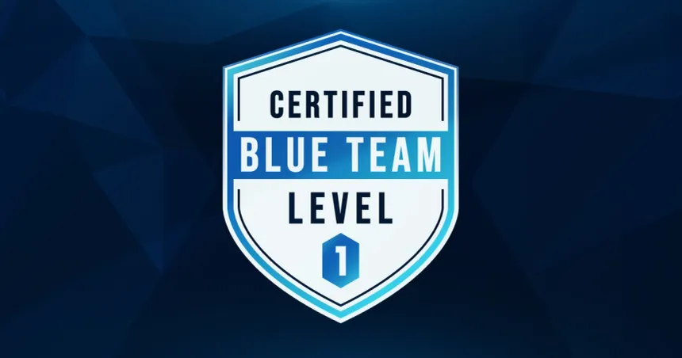

# 🛡️ Guía Práctica de Estudio para BTL1 (Blue Team Level 1) 🛡️

  
  
  

**Bienvenido/a a esta guía de estudio personal para la preparación de la certificación BTL1 de Security Blue Team.**

Este repositorio recopila apuntes, cheatsheets, workflows y recursos en **español**, con el objetivo de ayudarte a consolidar las habilidades prácticas necesarias para afrontar el examen BTL1 y desarrollarte como profesional de la ciberdefensa (Blue Team).

El enfoque es **eminentemente práctico**, reflejando la naturaleza del examen BTL1. Se centra en saber *qué hacer*, *cómo hacerlo* y *con qué herramientas* en escenarios realistas.

---

## 🎯 ¿Para Quién es Esto?

* Estudiantes preparando activamente la certificación BTL1.
* Profesionales Junior de Ciberseguridad (SOC Analysts Tier 1, Incident Responders Jr.) buscando reforzar bases prácticas.
* Entusiastas de la ciberdefensa que quieran una guía práctica y centralizada.

## ✨ Características Principales:

* **Enfoque Práctico:** Alineado con la filosofía del examen BTL1.
* **Cheatsheets Detallados:** Comandos y pasos clave para herramientas fundamentales.
* **Workflows Sugeridos:** Guías paso a paso para tareas comunes.
* **Estructura Modular:** Organizado por dominios BTL1 para un estudio enfocado.
* **Recursos Seleccionados:** Enlaces directos a herramientas, documentación y sitios de práctica.
* **Totalmente en Español:** Facilitando la comprensión de conceptos.

---

## 🛠️ Herramientas Principales Cubiertas

Este repositorio profundiza en el uso práctico de herramientas clave encontradas en el entorno BTL1 y en el día a día de un analista de seguridad:

* **SIEM:** Splunk (SPL), Elastic Stack (ELK/KQL Básico)
* **Análisis de Red:** Wireshark, Tshark
* **Forense de Memoria:** Volatility 2/3
* **Forense de Disco:** Autopsy, The Sleuth Kit (TSK), FTK Imager
* **Recolección y Análisis Rápido:** KAPE (Kroll Artifact Parser and Extractor)
* **Análisis de Malware/Archivos:** VirusTotal, Hybrid Analysis, Any.Run, ExifTool
* **File Carving:** Scalpel, Foremost
* **Análisis de Logs:** Comandos nativos (Linux/Windows), Sysinternals Suite
* **Inteligencia de Amenazas:** MITRE ATT&CK Framework, URLhaus, AbuseIPDB

---

## 🧭 Estructura del Repositorio

La guía se divide en módulos que corresponden a los dominios centrales de BTL1:

| Módulo                     | Descripción Breve                                                                 |
| :------------------------- | :-------------------------------------------------------------------------------- |
| `00_Introduccion_BTL1`     | Fundamentos de BTL1, mentalidad y estrategia para el examen.                      |
| `01_Phishing_Analysis`     | Disección de correos, análisis de URLs y adjuntos.                                |
| `02_Threat_Intelligence`   | Aplicación práctica de CTI, IoCs, TTPs y MITRE ATT&CK.                            |
| `03_Digital_Forensics`     | Adquisición y análisis de evidencia digital en disco y memoria (Win/Lin).         |
| `04_SIEM_Analysis`         | Búsqueda, correlación y análisis de logs centralizados (Splunk).                  |
| `05_Network_Analysis`      | Interpretación de tráfico de red, identificación de anomalías y protocolos (PCAPs). |
| `06_Incident_Response`     | Técnicas y comandos para la identificación y análisis inicial en sistemas vivos.  |
| `assets`                   | Imágenes, diagramas y otros recursos visuales de apoyo.                           |

---

## 🗺️ Tabla de Contenidos Detallada

Navega directamente a la sección que necesites:

* [**🚀 Introducción a BTL1**](./00_Introduccion_BTL1/)
    * [¿Qué es BTL1?](./00_Introduccion_BTL1/01_Que_es_BTL1.md)
    * [Filosofía del Examen](./00_Introduccion_BTL1/02_Filosofia_Examen.md)
    * [Estrategia General](./00_Introduccion_BTL1/03_Estrategia_General.md)
* [**🎣 Análisis de Phishing**](./01_Phishing_Analysis/)
    * [Conceptos Clave](./01_Phishing_Analysis/01_Conceptos_Clave.md)
    * [Herramientas](./01_Phishing_Analysis/02_Herramientas.md)
    * [Cheatsheet Comandos](./01_Phishing_Analysis/03_Cheatsheet_Comandos.md)
    * [Workflow Análisis](./01_Phishing_Analysis/04_Workflow_Analisis.md)
    * [Recursos Práctica](./01_Phishing_Analysis/05_Recursos_Practica.md)
* [**💡 Inteligencia de Amenazas**](./02_Threat_Intelligence/)
    * [Conceptos Clave](./02_Threat_Intelligence/01_Conceptos_Clave.md)
    * [MITRE ATT&CK](./02_Threat_Intelligence/02_MITRE_ATTACK.md)
    * [Herramientas](./02_Threat_Intelligence/03_Herramientas.md)
    * [Workflow IoC](./02_Threat_Intelligence/04_Workflow_IoC.md)
    * [Recursos Práctica](./02_Threat_Intelligence/05_Recursos_Practica.md)
* [**🕵️ Forense Digital**](./03_Digital_Forensics/)
    * [Principios y Adquisición](./03_Digital_Forensics/01_Adquisicion.md)
    * [Análisis de Disco](./03_Digital_Forensics/02_Analisis_Disco/)
        * [Artefactos Windows](./03_Digital_Forensics/02_Analisis_Disco/Windows_Artefactos.md)
        * [Artefactos Linux](./03_Digital_Forensics/02_Analisis_Disco/Linux_Artefactos.md)
        * [Herramientas Disco (Autopsy, TSK, KAPE)](./03_Digital_Forensics/02_Analisis_Disco/Herramientas_Disco.md)
        * [File Carving (Scalpel)](./03_Digital_Forensics/02_Analisis_Disco/File_Carving_Scalpel.md)
        * [Metadata (ExifTool)](./03_Digital_Forensics/02_Analisis_Disco/Metadata_ExifTool.md)
    * [Análisis de Memoria](./03_Digital_Forensics/03_Analisis_Memoria/)
        * [Conceptos Clave](./03_Digital_Forensics/03_Analisis_Memoria/Conceptos_Clave.md)
        * [Herramienta Volatility](./03_Digital_Forensics/03_Analisis_Memoria/Herramienta_Volatility.md)
    * [Recursos Práctica](./03_Digital_Forensics/04_Recursos_Practica.md)
* [**📊 Análisis SIEM**](./04_SIEM_Analysis/)
    * [Conceptos Clave](./04_SIEM_Analysis/01_Conceptos_Clave.md)
    * [Splunk Cheatsheet](./04_SIEM_Analysis/02_Splunk_Cheatsheet.md)
    * [Búsquedas Comunes](./04_SIEM_Analysis/04_Busquedas_Comunes.md)
    * [Recursos Práctica](./04_SIEM_Analysis/05_Recursos_Practica.md)
* [**🌐 Análisis de Red**](./05_Network_Analysis/)
    * [Conceptos Clave](./05_Network_Analysis/01_Conceptos_Clave.md)
    * [Wireshark / Tshark](./05_Network_Analysis/02_Wireshark_Tshark.md)
    * [Cheatsheet Filtros](./05_Network_Analysis/03_Cheatsheet_Filtros.md)
    * [Análisis Protocolos Específicos](./05_Network_Analysis/04_Analisis_Protocolos_Especificos.md)
    * [Patrones Maliciosos](./05_Network_Analysis/05_Patrones_Maliciosos.md)
    * [Recursos Práctica](./05_Network_Analysis/06_Recursos_Practica.md)
* [**🔥 Respuesta a Incidentes**](./06_Incident_Response/)
    * [Ciclo de Vida IR](./06_Incident_Response/01_Ciclo_Vida_IR.md)
    * [Live Response Windows](./06_Incident_Response/02_Live_Response_Windows.md)
    * [Live Response Linux](./06_Incident_Response/03_Live_Response_Linux.md)
    * [Contención y Erradicación](./06_Incident_Response/04_Contencion_Erradicacion.md)
    * [Recursos Práctica](./06_Incident_Response/05_Recursos_Practica.md)

---

## ✨ Cómo Sacarle Partido

1.  **Explora por Dominios:** Usa la Tabla de Contenidos para saltar directamente al área que necesitas repasar.
2.  **Profundiza en Herramientas:** Revisa los cheatsheets y workflows específicos para cada herramienta clave.
3.  **Practica:** Aplica los comandos y técnicas en laboratorios (BTLO, CyberDefenders, TryHackMe). Este repo es tu compañero de consulta rápida.
4.  **Adapta y Expande:** ¡Este es tu espacio! Edita, añade tus propios descubrimientos, notas o scripts útiles.
5.  **Visualiza:** Donde veas diagramas o menciones a flujos, intenta visualizarlos mentalmente o dibujarlos.

---

## 🤝 Contribuciones y Feedback

Aunque este es principalmente un repositorio de estudio personal, si encuentras algún error, tienes sugerencias para mejorar el contenido o quieres proponer alguna adición, por favor **abre un Issue** en este repositorio. Todo feedback constructivo es bienvenido.

---

## ⚠️ Disclaimer y Confidencialidad

La información aquí contenida se basa en experiencia personal, el material original proporcionado y recursos de acceso público. La ciberseguridad es un campo dinámico. **Siempre verifica la información con el syllabus oficial de BTL1 y la documentación de las herramientas.** No me hago responsable del uso de la información aquí presentada.

**Importante: Se respeta estrictamente el Acuerdo de Confidencialidad (NDA) de Security Blue Team.** Este repositorio no contiene, ni contendrá, preguntas filtradas, soluciones directas a los escenarios del examen ni ninguna información propietaria cubierta por dicho acuerdo. El objetivo es consolidar conocimientos y técnicas generales aplicables, no comprometer la integridad de la certificación.

---

## 📄 Licencia

Distribuido bajo la Licencia **[`LICENSE`](./LICENSE)**. Mira el archivo [`LICENSE`](./LICENSE) para más detalles.